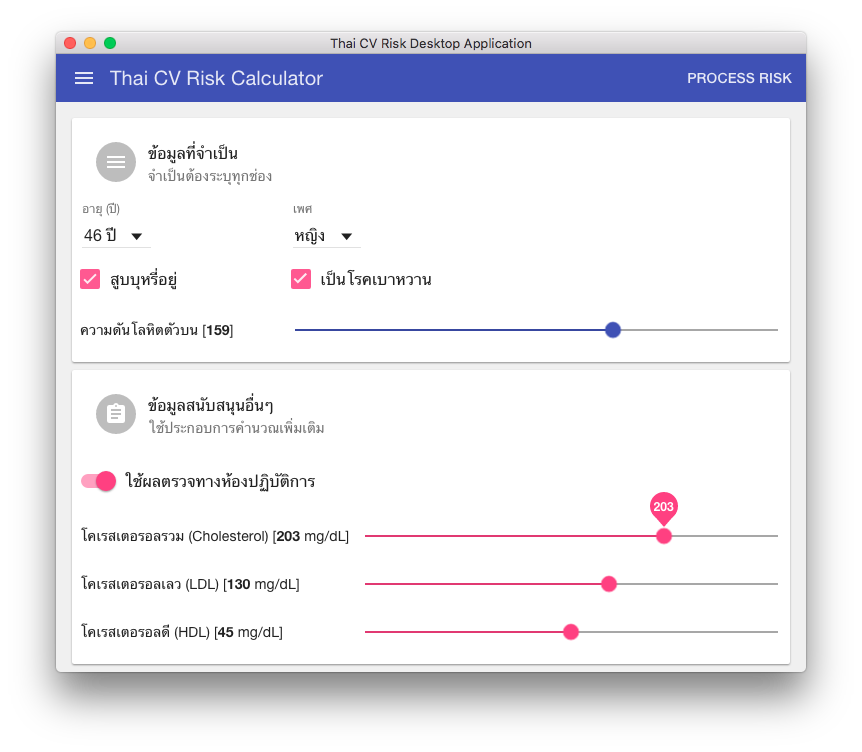
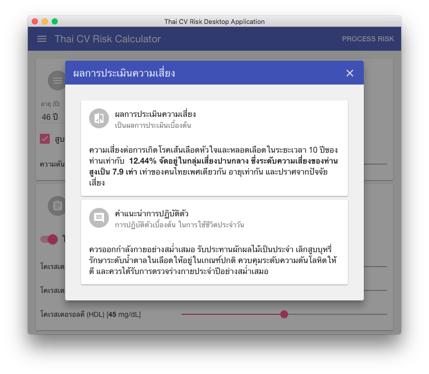
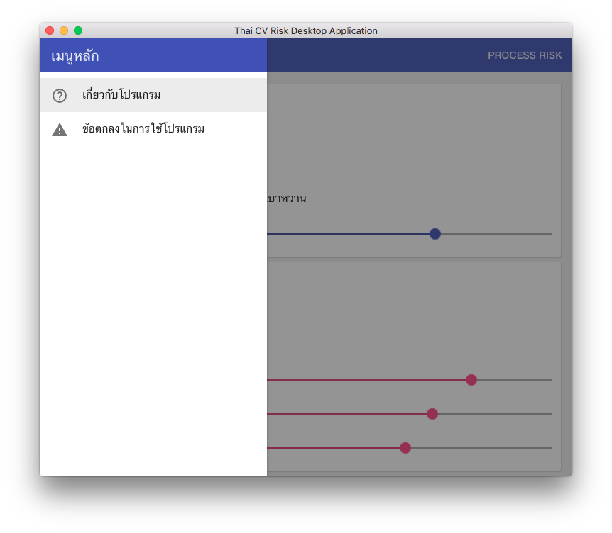
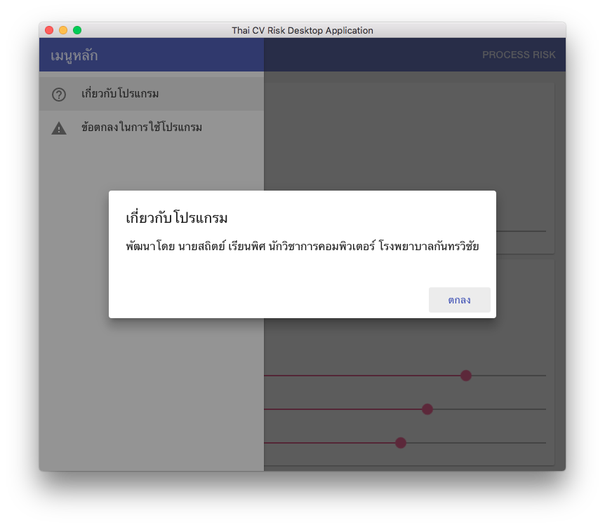
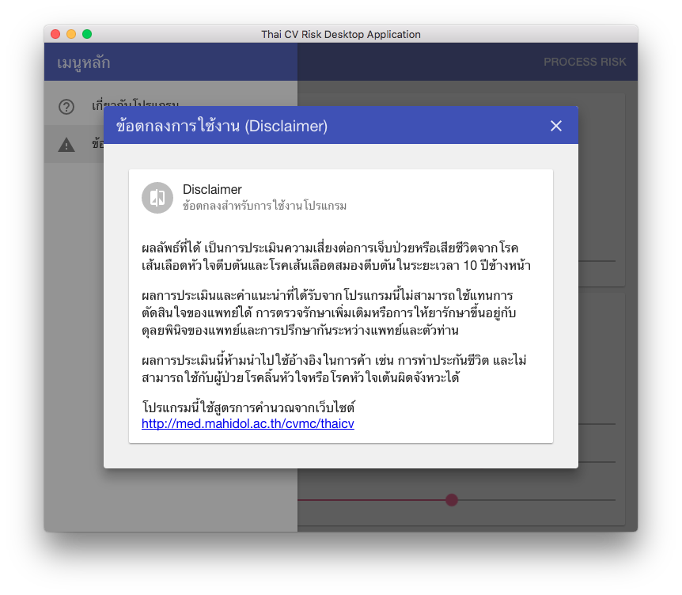

# thai-cv-risk

## How to


```bash
# Clone this repository
$ git clone https://github.com/siteslave/thai-cv-risk.git
# Go into the repository
$ cd thai-cv-risk
# Install dependencies and run the app
$ npm install

# Install electron
$ npm install -g electron-prebuilt

# Running
$ electron .

```

## How to deployment

```bash
$ cd ..
# Install electron-packager
$ npm install electron-packager -g
# Deployment/Packaging
$ electron-packager thai-cv-risk ThaiCVDRisk --platform=all --arch=all --version=0.36.2
```


# Screen Short










